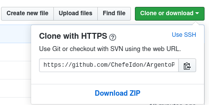

# ArgentoPack
Sonidos Argentos para conversaciones de Age of Empires II HD (2013)
"El Señor Pack" by ChefeIdon

## Instalacion Windows
	
1- Descomprimir el archivo zip 

2- Tendras que ubicar la carpeta donde esta Age of Empire 2 instalado

    normalmente suele ser:
    "C:\Program Files (x86)\Steam\steamapps\common\Age2HD"

3- Entrar a la carpeta en donde se encuentran los archivos de audio del juego:

	"\Age2HD\resources\es\sound\"

4- Elimina la carpeta 'taunt' existente.

5- Copiar la carpeta 'taunt' del archivo que descargaste y pegala en:

	"\Age2HD\resources\es\sound\"

4- Copia el archivo "key-value-strings-utf8.txt" y pegalo en:

    "resources\es\strings\key-value\"

    (ANTES RENOMBRA ARCHIVO ORIGINAL POR "key-value-strings-utf8-backup.txt")

5- Enjoy

## Instalacion Linux

1- copia y pega los siguientes comandos en una terminal

    git clone https://github.com/ChefeIdon/ArgentoPack.git
    cd ArgentoPack
    mv ~/.steam/steam/steamapps/common/Age2HD/resources/es/sound/taunt ~/.steam/steam/steamapps/common/Age2HD/resources/es/sound/taunt_back
    cp -r taunt ~/.steam/steam/steamapps/common/Age2HD/resources/es/sound/
    mv ~/.steam/steam/steamapps/common/Age2HD/resources/es/strings/key-value/key-value-strings-utf8.txt ~/.steam/steam/steamapps/common/Age2HD/resources/es/strings/key-value/key-value-strings-utf8-backup.txt
    cp key-value/key-value-strings-utf8.txt ~/.steam/steam/steamapps/common/Age2HD/resources/es/strings/key-value/

2- Listo el pollo amigueros.

## Lista de Audios

01 - Sabe
02 - Haceme un petardo
03 - Carne
04 - No oigo que talen
05 - Puede darme dinero
06 - Yo queria mani
07 - Ahhh
08 - No tenemos escapatoria
09 - Opa
10 - Que olor a leche
11 - Risa Ricky Fort
12 - El Coco esta en la casa
13 - Y vos sos un boludo
14 - Mandale mecha
15 - Sacá la mano de ahi
16 - Callate carajo
17 - Gracias pa
18 - Guachin
19 - Es Putifarri
20 - Tarado eh
21 - Esas cositas lindas
22 - Basta chicos
23 - Miami
24 - La concha de la lora
25 - Excelente
26 - Me persigue la desgracia
27 - Chino no come eso
28 - Mamá
29 - A la puta
30 - Wipu
31 - Hola culiados
32 - Coño
33 - Abuela me haces re mal
34 - No de nuevo
35 - Vamos a hacerlo
36 - Llego el lechero
37 - Tan vulgar
38 - Paga ra prata
39 - Aliado
40 - Neutral
41 - Enemigo
42 - Canción de muerte
43 - Que bien el tipo
44 - Negro garca
45 - Cubilla
46 - A comerla
47 - Me cago en la puta madre
48 - Pedazo de boludo
49 - Se murio
50 - Eeee
51 - Ya van a llegar
52 - Abri pelotudo
53 - Ya es toda wey
54 - Inimputable
55 - Más recondito
56 - Máquina de agujeros
57 - This paquetito
58 - Esta es para vos
59 - No tengo cosa
60 - Fija bien
61 - Rrregar a la gente
62 - Los Yakuza
63 - Pillo pillo
64 - Habla bien
65 - Hola
66 - Me cago quemando
67 - Ud no puede decir eso
68 - Y ella
69 - Gemido
70 - Karina
71 - La vaca
72 - Palabra
73 - Cosme Fulanito
74 - Es y no es
75 - Jalea
76 - Los alemanes
77 - Mi planeta me necesita
78 - Milhouse
79 - Ud es diabólico
80 - Yo no fui
81 - Sobreviviendo

## Desinstalación

Para desinstalar los sonidos, solo debes ir a las propiedades del juego desde Steam, en la pestaña de Archivos locales tocar en 'Verificar Integridad de Archivos'. Steam descargará los archivos originales y borrará el ArgentoPack.

# No me lo agradezcan a mi, sino a mi navaja.

Este pack de sonidos se distribuyen gratuitamente y sin garantia alguna, usar responsablemente
